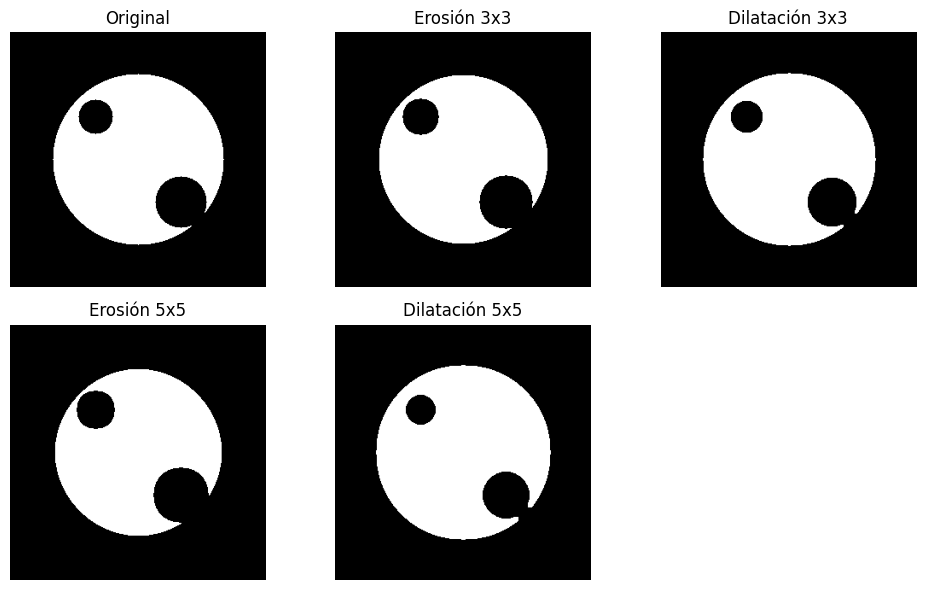
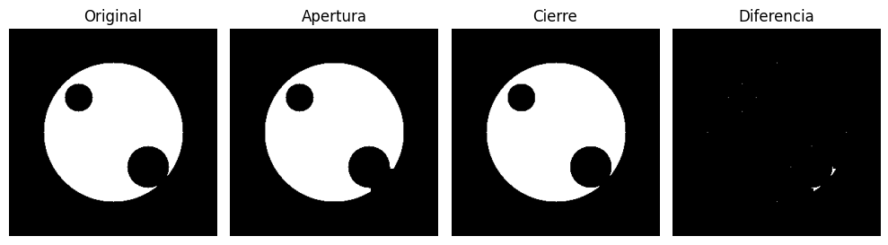
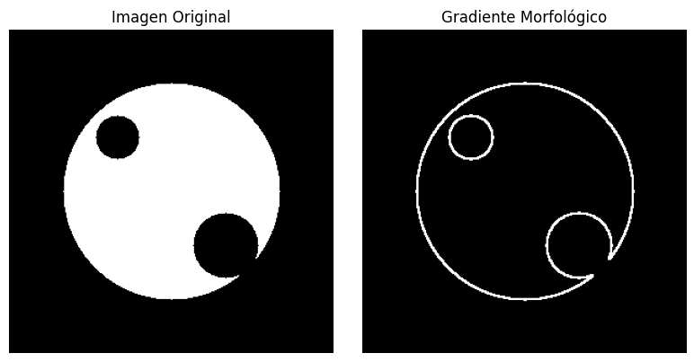
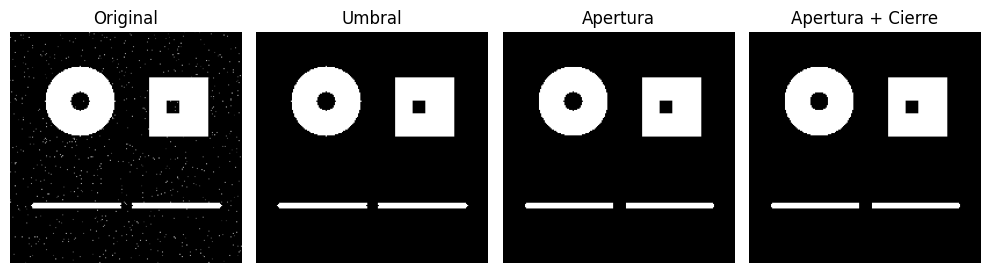

# Procesamiento de Imágenes - Trabajo Práctico 3

Integrantes:

- Francisco Devaux
- Agustín Yornet de Rosas

## Introducción

Este trabajo corresponde al Trabajo Práctico 3 de Procesamiento de Imágenes, y consiste en los siguientes documentos:

- Informe hecho en Markdown (informe.md) con detalles sobre la resolución de los ejercicios.
- [Notebook interactivo de Python (PDI_TP3.ipynb)](PDI_TP3.ipynb) con la resolución de los ejercicios y su código fuente. Este puede ejecutarse localmente, celda por celda.
- Carpeta `imágenes/` con las imágenes utilizadas para la resolución de este Trabajo Práctico.

Para poder replicar los resultados, se recomienda crear un entorno virtual, instalar las depedencias contenidas en [requirements.txt](requirements.txt) y correr las celdas una por una, o todas juntas, de forma secuencial. Se ha utilizado Python 3.10.12 como Kernel para ejecutar el [notebook interactivo](PDI_TP3.ipynb).

Se recomienda usar Visual Studio Code para ir ejecutando el Notebook a medida que se va leyendo este informe.

## 1. Operadores morfológicos

### Ejercicio 1

> Ir y ejecutar subsección "Ejercicio 1"

Se aplicaron operaciones de erosión y dilatación sobre una imagen binaria utilizando kernels de diferentes tamaños.

```python
kernel_3 = np.ones((3,3), np.uint8)
kernel_5 = np.ones((5,5), np.uint8)

erosion_3 = cv2.erode(imagen_binaria, kernel_3, iterations=1)
dilatacion_3 = cv2.dilate(imagen_binaria, kernel_3, iterations=1)

erosion_5 = cv2.erode(imagen_binaria, kernel_5, iterations=1)
dilatacion_5 = cv2.dilate(imagen_binaria, kernel_5, iterations=1)
```

Al aplicar operaciones morfológicas sobre la imagen binaria `img_binaria2.png`, se observa que la erosión reduce el tamaño de los objetos blancos, eliminando bordes finos y achicando las figuras, especialmente con kernels más grandes como el de $5x5$. En cambio, la dilatación produce el efecto contrario: expande las regiones blancas, cerrando pequeños huecos y suavizando contornos. Comparando ambas operaciones con distintos tamaños de kernel, se evidencia que el tamaño del elemento estructurante influye directamente en la magnitud del cambio: a mayor kernel, mayor la transformación. Los resultados se pueden observar en la figura que se muestra a continuación.



### Ejercicio 4

> Ir y ejecutar subsección "Ejercicio 4"

Se aplicaron apertura y clausura sobre una imagen binaria para analizar sus diferencias.

```python
kernel = np.ones((5, 5), np.uint8)

apertura = cv2.morphologyEx(imagen_binaria, cv2.MORPH_OPEN, kernel)

cierre = cv2.morphologyEx(imagen_binaria, cv2.MORPH_CLOSE, kernel)

diferencia = cv2.absdiff(apertura, cierre)
```

Con la apertura, los bordes del símbolo aparecen más limpios y simplificados, eliminando algunas zonas con bordes filosos o ruidosos. Por su parte, el cierre hace que el interior del símbolo blanco se vea más continuo, con bordes más robustos y sin huecos. La imagen de diferencia resalta las zonas afectadas por ambas operaciones, donde se observan pequeñas modificaciones en los bordes y detalles finos, lo que indica que, aunque la forma global se mantiene, existen alteraciones estructurales sutiles. Los resultados se pueden observar en la figura que se muestra a continuación.



### Ejercicio 5

> Ir y ejecutar subsección "Ejercicio 5"

Se utilizó la operación de gradiente morfológico para visualizar bordes:
```python
kernel = np.ones((3, 3), np.uint8)

gradiente = cv2.morphologyEx(imagen_binaria, cv2.MORPH_GRADIENT, kernel)
```

La operación de gradiente morfológico aplicada a la imagen `img_binaria2.png` permite visualizar de forma clara y precisa los bordes de las región blanca. Como se observa en la figura presentada, el resultado destaca únicamente los contornos del símbolo, eliminando el interior de la misma. Esto se logra al calcular la diferencia entre la dilatación y la erosión de la imagen original. 



### Ejercicio 7

> Ir y ejecutar subsección "Ejercicio 7"

Se utilizó una combinación de umbralización, apertura y cierre morfológico para segmentar la imagen

```python
_, umbralizada = cv2.threshold(imagen, 200, 255, cv2.THRESH_BINARY)

kernel = np.ones((3, 3), np.uint8)

apertura = cv2.morphologyEx(umbralizada, cv2.MORPH_OPEN, kernel)

cierre = cv2.morphologyEx(apertura, cv2.MORPH_CLOSE, kernel)```
```

La operación de gradiente morfológico aplicada a la imagen `imagen_binaria_ruido.png` permite visualizar de forma clara y precisa los bordes de las región blanca. Como se observa en la figura, el resultado destaca únicamente los contornos del símbolo, eliminando el interior de la misma. Esto se logra al calcular la diferencia entre la dilatación y la erosión de la imagen original. Los resultados se muestran a continuación.


